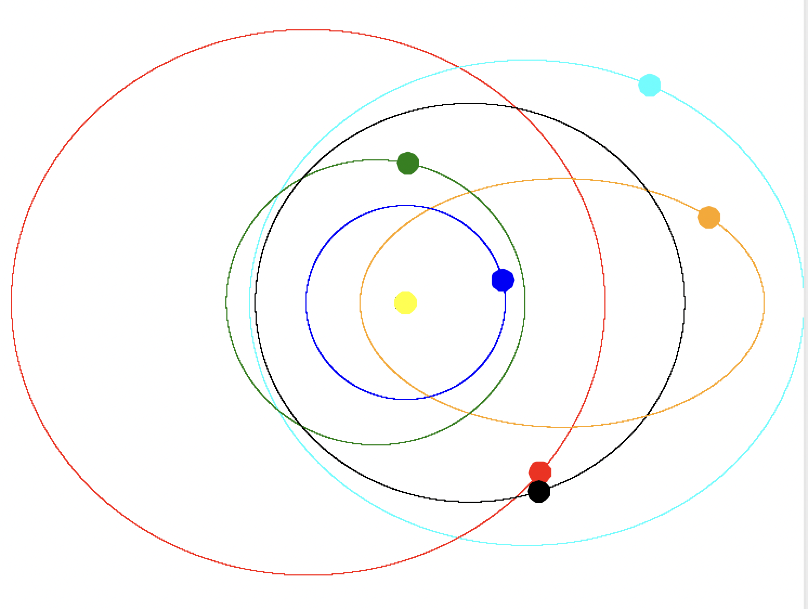

# solar-system
solar system animation in python



## How to run
```
python week14-solar-system.py
```

## Branching strategy followed 
I followed GitFlow branching model.
This branching strategy consists of the following branches:
- Main
- Develop
- Feature- to develop new features that branches off the develop branch 
- Release- help prepare a new production release; usually branched from the develop branch and must be merged back to both develop and main
- Hotfix- also helps prepare for a release but unlike release branches, hotfix branches arise from a bug that has been discovered and must be resolved; it enables developers to keep working on their own changes on the develop branch while the bug is being fixed.
The main and develop branches are considered to be the main branches, with an infinite lifetime, while the rest are supporting branches that are meant to aid parallel development among developers, usually short-lived.


